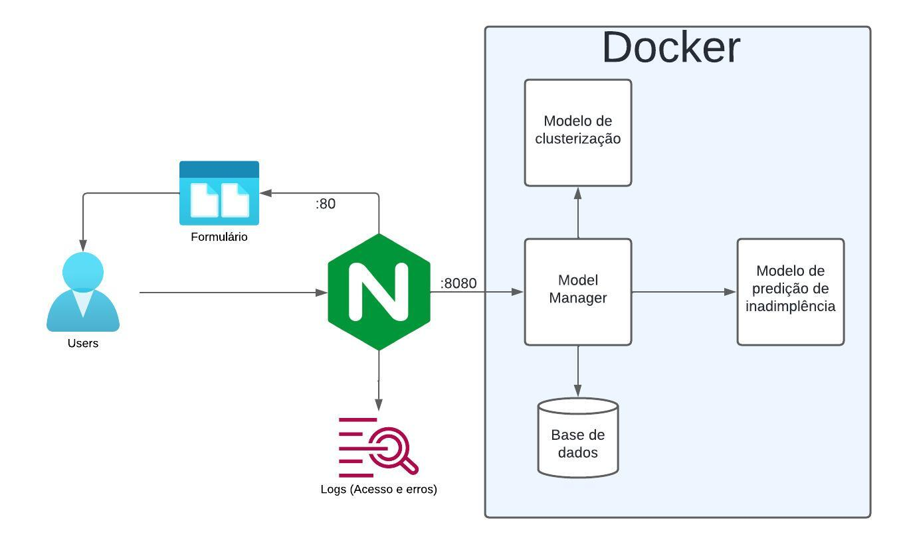

# MLOps

## Inicializar o projeto

Para inicializar o projeto, basta executar o comando:

```shell docker-compose up --build```

Após o ambiente inicializado, para testar as API`s:

- Clusterização

```curl -X POST http://localhost/cluster -H "Content-Type: application/json" -d '{"idade": 30, "etnia": "Branco", "genero": "Masculino", "casa_propria": 1, "outras_rendas": 0, "estado_civil": "Casado", "escolaridade": "Superior"}'```

- Previsão de inadimplência

```curl -X POST http://localhost/predict -H "Content-Type: application/json" -d '{"idade": 30, "etnia": "Branco", "genero": "Masculino", "casa_propria": 1, "outras_rendas": 0, "estado_civil": "Casado", "escolaridade": "Superior"}'```

## Arquitetura



